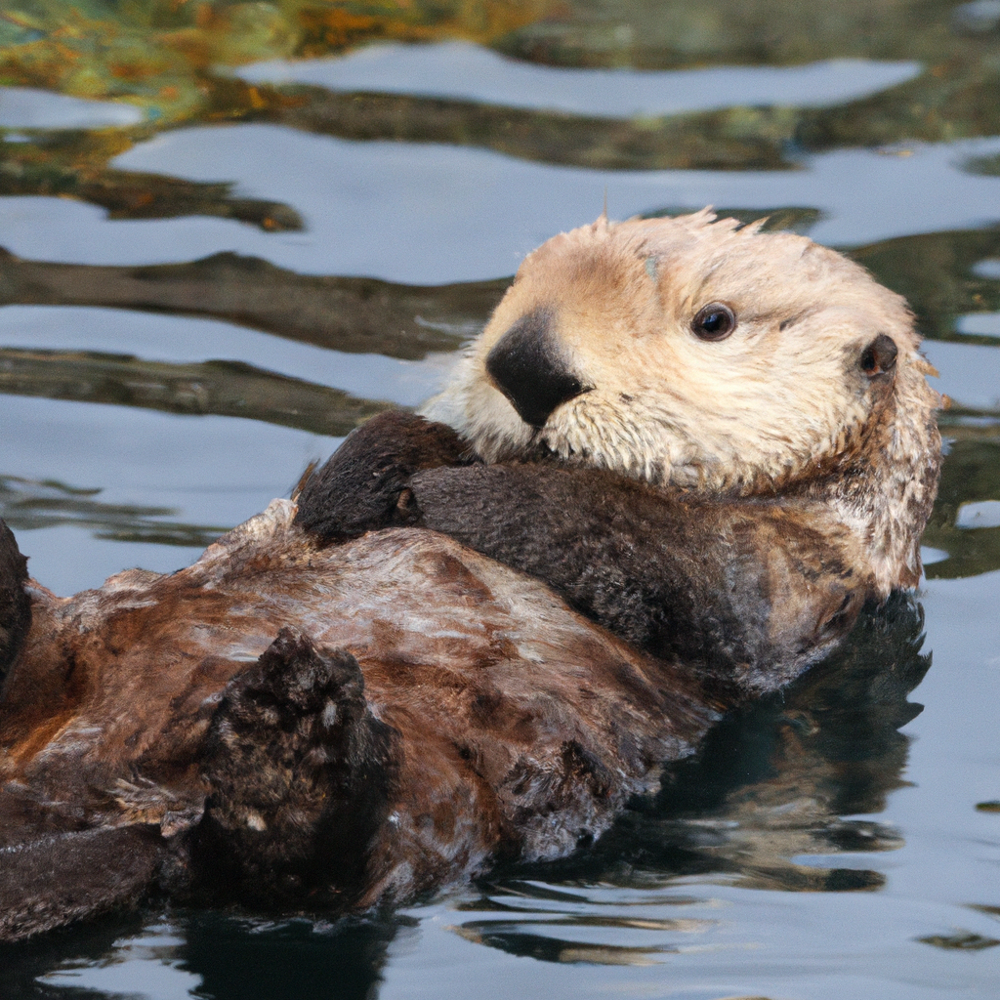

# OpenAI API Scripts

This repository contains scripts that interact with the OpenAI API.

Current Scripts:

- `chatbot_query.pl` - A Perl script to make chatbot API calls to OpenAI
- `chatbot_query.py` - A Python script to make chatbot API calls to OpenAI
- `openai_image_generator.pl` - A Perl script to generate a picture of a sea otter
                                using API calls to OpenAI

## Getting Started

To use these scripts, you'll need to:

1. Clone this repository
2. Install the necessary dependencies
3. Set your OpenAI API key as an environment variable

Then, you can run a script like so:

`perl chatbot_query.pl` or `python chatbot_query.py` or `openai_image_generator.pl`

## Script Output

